# GameBacklog

Sistema web para organizar os jogos que você quer jogar, está jogando e já
terminou — um backlog pessoal de jogos.

> Trabalho Prático 1 — Engenharia de Prompt e Contexto na Prática
> Grupo: _[Lucas de Freitas Bovo - RA:253623042 /Gabriel Felipe Alexandre dos Santos - RA:253622502 /Pedro Paulo Barbosa Arantes - RA: 253622492]_

---

## 1. O que o projeto faz e opção escolhida

O GameBacklog permite:

- Adicionar um jogo ao backlog (título, plataforma, status inicial).
- Organizar os jogos em três status: **Quero Jogar**, **Jogando** e
  **Terminado**, movendo livremente entre eles (pode pular etapa).
- Ao mover um jogo para **Jogando**, registrar a data de início.
- Ao mover um jogo para **Terminado**, registrar a data de conclusão
  (obrigatória) e a nota pessoal (0 a 5 estrelas, opcional).
- Editar qualquer campo de um jogo já cadastrado (título, plataforma,
  nota, datas), respeitando a mesma regra de nota do fluxo de status.
- Remover um jogo do backlog.
- Buscar por nome e filtrar/ordenar por data de início, data de
  conclusão, nota ou ordem alfabética.
- Ver estatísticas simples: quantos jogos há em cada status e quantos já
  foram concluídos, em relação ao total do backlog.

**Opção escolhida:** projeto de estudo/pessoal (não é uma feature da
Escola de TI) — um sistema que o próprio grupo usaria de verdade para
organizar sua fila de jogos.

**Stack:** Next.js (App Router) + TypeScript + Tailwind, sem banco de
dados — dados mocados, estado 100% client-side (`useState`/Context).
Essa decisão foi tomada depois de identificar que uma Server Action
mutando um array em memória não sobreviveria de forma confiável a
funções serverless efêmeras no Vercel; como o projeto já era sem
persistência real por escopo, mover o estado inteiramente para o client
resolveu o problema pela raiz, ao custo de a lista resetar num F5 (uma
troca aceita conscientemente, documentada em `requisitos.md`).

---

## 2. System prompt usado (completo)

O arquivo abaixo (`CLAUDE.md`, na raiz do repositório) é lido
automaticamente pelo Claude Code como contexto de projeto em toda
sessão, e funciona como o system prompt documentado deste trabalho.
Estrutura baseada no framework RTF (Role, Task, Format).

```markdown
# CLAUDE.md — GameBacklog

> Este arquivo é o system prompt documentado do projeto, conforme exigido no
> Trabalho Prático 1 (Engenharia de Prompt e Contexto). Ele é lido pelo
> Claude Code como contexto de projeto antes de qualquer tarefa. Estrutura
> baseada no framework RTF (Role, Task, Format), com escopo/restrições e
> técnicas de prompt adicionadas explicitamente.

## Role (Papel)

Você é um assistente de desenvolvimento full-stack trabalhando no projeto
**GameBacklog**, um sistema web para organizar jogos em três status:
**"quero jogar"**, **"jogando"** e **"terminei"**. Você atua como um par de
desenvolvimento sênior, mantendo consistência com as decisões de arquitetura
e escopo já registradas neste documento — não como um assistente genérico
sem contexto do projeto.

## Task (Tarefa)

- Implementar funcionalidades solicitadas, seguindo a arquitetura e as
  convenções já estabelecidas no repositório.
- Antes de gerar código extenso, explicar em poucas linhas a decisão
  arquitetural tomada e por quê.
- Ao encontrar ambiguidade que não impede o progresso, declarar a suposição
  assumida e seguir; só perguntar quando a ambiguidade realmente bloquear
  a tarefa.
- Sinalizar quando uma solicitação sair do escopo do MVP definido abaixo.

## Format (Formato de resposta)

- Código sempre acompanhado de explicação breve do porquê, nunca só o
  código sem contexto.
- Preferir diffs pontuais a reescrever arquivos inteiros sem necessidade.
- Ao gerar conteúdo estruturado (ex: template de card de jogo, schema de
  dados), seguir o padrão de exemplos fornecido (ver técnica few-shot
  abaixo).

## Escopo e restrições

- Nesta fase (MVP), o projeto é single-user — sem autenticação/multiusuário.
- Não integrar com APIs externas de jogos (IGDB, Steam, etc.) a menos que
  explicitamente solicitado em uma tarefa futura.
- Nunca inventar dados de jogos que não existem ou que o usuário não
  forneceu.
- O produto final **não tem chamadas de IA em tempo de execução** — toda
  IA é usada exclusivamente na fase de construção do projeto, via Claude
  Code. Não implementar nenhuma integração de IA no código do app.

## Técnicas de prompt aplicadas (com justificativa)

- **Few-shot**: usado para geração de conteúdo estruturado e repetitivo
  (ex: templates de card de jogo, mensagens de commit padronizadas),
  fornecendo 2+ exemplos de entrada/saída no prompt. Justificativa: reduz
  variação de formato entre respostas, o que importa quando o resultado
  alimenta uma UI que espera uma estrutura consistente.
- **Zero-shot**: usado como grupo de controle, não como técnica isolada.
  A mesma tarefa foi testada sem exemplos (zero-shot) e com exemplos
  (few-shot) para medir a diferença de qualidade/consistência do resultado
  e de consumo de tokens — essa comparação é a evidência que justifica a
  escolha por few-shot nos casos onde ele foi aplicado de propósito.

## Log de chamadas

- Os logs de cada chamada feita ao Claude Code durante a construção são
  gravados automaticamente em `~/.claude/projects/`.
- Ao final de cada sessão de trabalho, os dados são extraídos via script
  Python (`extrair_log_claude_code.py`) para uma tabela CSV, cruzando com
  um mapa manual de `tecnica_prompt` e `system_prompt_versao` por sessão.
- `ccusage` é usado para gerar visualizações/relatórios de tokens e custo
  como evidência complementar (prints para o README).
```

---

## 3. Técnica de prompt aplicada e justificativa

**Técnica escolhida: few-shot**, comparada contra zero-shot como grupo de
controle (não como técnica concorrente — zero-shot é ausência de técnica).

**Onde foi aplicada:** geração do array de dados mocados
(`lib/jogos/mock-store.ts`), pedindo a mesma lista de 7 jogos em duas
versões — uma sem exemplo (zero-shot) e outra fornecendo 2 exemplos
completos de objeto `Jogo` já formatados (few-shot).

### Zero-shot

Gerada sem nenhum exemplo — o modelo decidiu a estrutura do array
sozinho, com base apenas na interface `Jogo` já definida no projeto.

### Few-shot

Gerada fornecendo 2 exemplos completos de objeto `Jogo` (Hollow Knight,
Hades) no próprio prompt, pedindo que o modelo seguisse o mesmo padrão
de estilo para os 7 jogos da lista.


Comparando os dois arquivos gerados linha a linha, o conteúdo dos dois
arrays saiu **idêntico** (mesmos 7 jogos, mesma estrutura, mesma
formatação). A única diferença encontrada foi que a versão **zero-shot**
incluiu um comentário explicando a regra de negócio da nota
(`// 0 a 5 estrelas — só faz sentido quando status é "terminado"`),
enquanto a versão **few-shot**, seguindo rigidamente o padrão dos
exemplos fornecidos (que não tinham esse comentário), **não** incluiu.

**Conclusão documentada (justificativa da escolha final):** para essa
estrutura de dados simples e já bem tipada, few-shot não trouxe ganho de
qualidade que justificasse o custo extra de tokens — o grupo optou por
manter a versão **zero-shot** como definitiva no código, exatamente por
ela ter preservado uma informação de contexto (a regra de negócio) que o
few-shot suprimiu ao imitar estritamente o formato dado. Esse é o
achado central do teste: **few-shot pode reduzir a captura de contexto
adicional relevante quando os exemplos fornecidos não cobrem esse
detalhe** — o modelo tende a imitar o padrão à risca, mesmo quando isso
descarta informação útil disponível no contexto mais amplo.

_A geração few-shot foi pedida em uma sessão separada e limpa, com
medição isolada: 5.576 tokens de saída, 6.367 tokens de cache write,
custo ≈ $0,19. A geração zero-shot ocorreu misturada ao mesmo turno do
scaffold inicial do projeto, então seu custo isolado não pôde ser
medido com a mesma precisão — essa limitação está registrada na tabela
de chamadas (coluna `tecnica_prompt`: "zero-shot (inclui scaffold do
projeto)")._

---

## 4. Teste de curadoria de contexto

**Pergunta-teste usada nas duas versões:** *"Como devo estruturar a
função que atualiza o status de um jogo para 'terminado', considerando
as regras de nota e data de conclusão?"*

### Contexto completo (`@requisitos.md`)

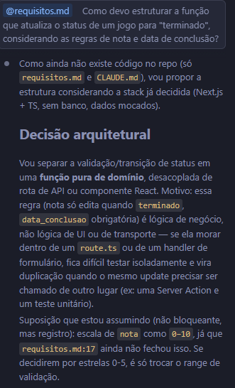

O arquivo inteiro foi incluído via `@requisitos.md` (equivalente ao
`@file` do Claude/Cursor).

### Contexto reduzido (trecho colado manualmente)

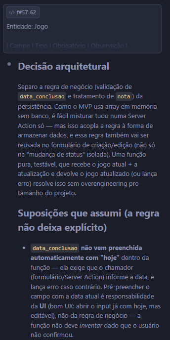

Apenas o trecho relevante do `requisitos.md` (a tabela de campos do
jogo + a seção de regras de negócio) foi selecionado e colado
manualmente no prompt, sem usar `@file`.

### Resultado da comparação de tokens

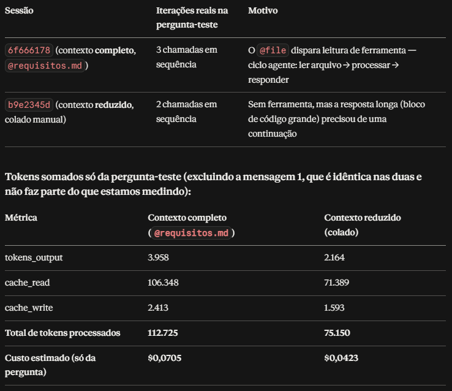

Isolando o turno da pergunta-teste (excluindo a mensagem inicial de
carregamento de contexto, idêntica nas duas sessões):

| Métrica | Contexto completo (`@requisitos.md`) | Contexto reduzido (colado) |
|---|---|---|
| tokens de saída | 2.164 | 3.958 |
| cache write | 1.593 | 2.413 |
| cache read | 71.389 | 106.348 |
| **Total de tokens processados** | **75.146** | **112.719** |

**Resultado contraintuitivo:** o contexto **reduzido** consumiu mais
tokens que o contexto **completo** via `@requisitos.md` — o oposto do
que se esperaria de uma curadoria manual. A hipótese mais provável é
efeito de cache: a primeira mensagem de cada sessão ("leia e não diga
nada" + o enunciado do trabalho) já levou o Claude Code a explorar o
projeto e, possivelmente, cachear o conteúdo de `requisitos.md` antes
da pergunta-teste — o que teria tornado a leitura via `@requisitos.md`
um acerto de cache barato, enquanto colar um trecho novo manualmente
contou como conteúdo não cacheado, mais caro de processar. Essa é uma
hipótese razoável, não uma causa confirmada — vale registrar como
observação em aberto, não como conclusão definitiva.

### Achado qualitativo (mais relevante que o número de tokens)

As duas versões geraram **arquiteturas de código diferentes** para a
mesma pergunta:

- **Contexto reduzido:** função usando `throw` de uma classe de erro
  customizada (`RegraDeNegocioError`) — estilo imperativo, sem citar
  nenhuma linha específica do documento.
- **Contexto completo:** função usando retorno tipado
  `{ ok: true/false, ... }` — estilo funcional, justificado
  explicitamente ("evita try/catch espalhado pelo formulário, força o
  TypeScript a tratar os dois casos"), e citando linhas específicas do
  arquivo lido (`requisitos.md:59-60`, `:61-62`).

Além disso, apenas a versão de **contexto completo** identificou uma
ambiguidade real do `requisitos.md` (a escala de nota, não fechada na
época do teste — `requisitos.md:17`) e sinalizou como suposição
assumida — a versão reduzida não viu essa ambiguidade, porque o trecho
colado não incluía a linha onde ela aparece.

**Conclusão:** o benefício da curadoria de contexto, nesse teste, não
apareceu como economia de tokens (o oposto ocorreu) — apareceu como
**risco de perder informação relevante**: a versão com menos contexto
não captou uma ambiguidade que a versão completa capturou. O grupo
escolheu a arquitetura de retorno tipado (vinda do contexto completo)
como definitiva no projeto, por ser mais adequada ao caso de uso de
formulário — decisão de produto tomada com base no resultado do teste,
não assumida a priori.

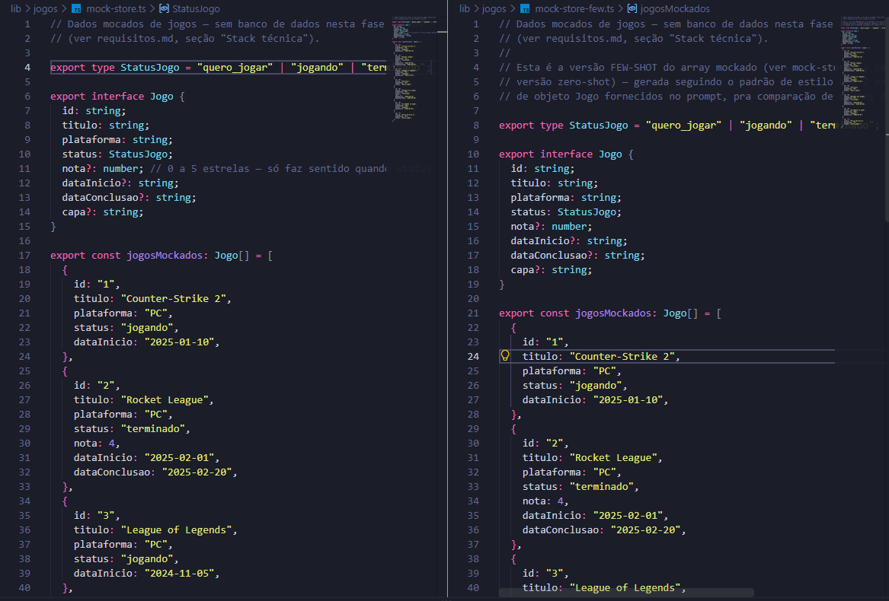

---

## 5. Tabela de chamadas, tokens e custo

O log completo de todas as chamadas de API feitas ao Claude Code durante
a construção do projeto está em `logs/log_completo_atualizado.xlsx`
(dados extraídos diretamente dos transcripts `.jsonl` do Claude Code,
também incluídos em `logs/` para rastreabilidade).

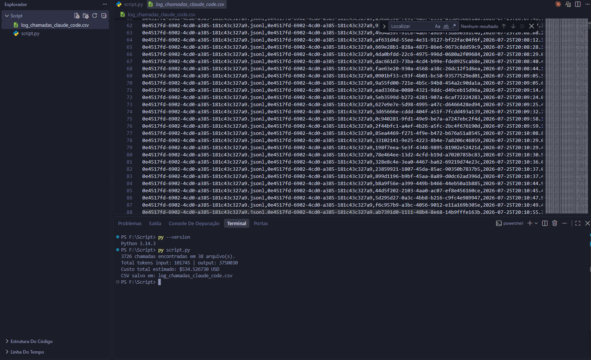

**Resumo:**

| Métrica | Valor |
|---|---|
| Total de chamadas registradas (após remover duplicatas de log) | 282 |
| Total de tokens de saída | 173.412 |
| Total de tokens de cache read | 52.670.119 |
| Total de tokens de cache write | 438.654 |
| **Custo total estimado da sessão** | **≈ $14,02 USD** |
| Modelo usado | `claude-sonnet-5` |

**Observação sobre o custo:** a maior parte do custo total não vem de
geração de código, e sim de **cache read** — o desenvolvimento ocorreu
majoritariamente em uma única sessão contínua, que acumulou até ~330 mil
tokens de contexto ao longo do dia. Cada nova mensagem releu esse
contexto acumulado do cache, e embora cache read seja cobrado a uma
fração do preço de input normal, a soma ao longo de centenas de chamadas
foi o principal fator de custo. Isso sugere que reiniciar sessões
periodicamente durante o desenvolvimento reduziria custo, ao preço de
perder contexto acumulado entre elas — um trade-off real de engenharia
de contexto, e não apenas um detalhe de configuração.

**Ferramenta usada para extrair tokens/custo:** `ccusage`
(`npx ccusage@latest`), complementado por um script Python próprio
(`extrair_log_claude_code.py`, também no repositório) que processa os
transcripts `.jsonl` diretamente para permitir análise por chamada
individual e cruzamento com a técnica de prompt usada em cada uma.

**Evidência (prints/logs):** ver pasta `logs/` — planilha tratada,
arquivos `.jsonl` originais das sessões, e prints das telas
funcionando anexados na entrega.

## Tabelas de Gastos Pós uso de Few-Shot e Zero-Shot (6f666178.. = Zero-Shot / b9e2345d.. = Few-Shot)

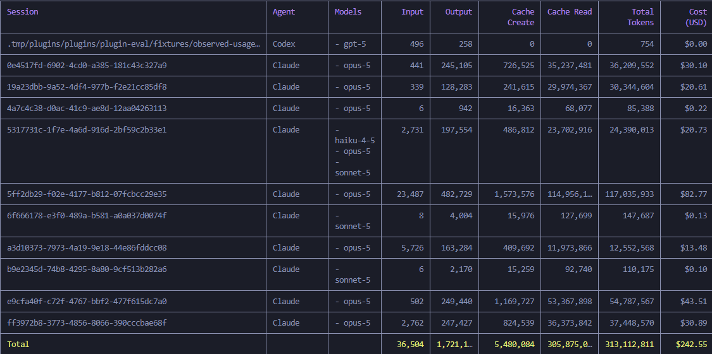

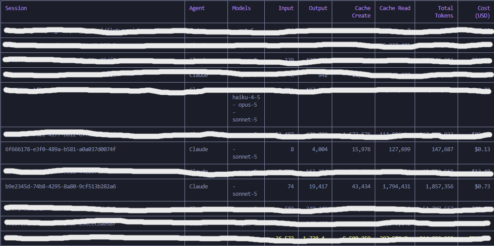

---

## 6. Link da URL publicada

[ACESSE O SITE][prompt-engineering-red.vercel.app] 

---

## 7. Integrantes

_[Lucas de Freitas Bovo - RA:253623042]_
_[Gabriel Felipe Alexandre dos Santos - RA:253622502]_
_[Pedro Paulo Barbosa Arantes - RA: 253622492]_

---

## Observações adicionais do processo (achados de engenharia de prompt)

- **Limitação recorrente de encoding:** em três ocasiões separadas, o
  Claude Code falhou ao escrever ou casar caracteres Unicode combinantes
  (acentos) diretamente no código — na escrita do arquivo, na regex, e
  no matching da ferramenta de edição. A causa raiz só foi resolvida
  extraindo a lógica de normalização de texto para uma função utilitária
  única, reaproveitada em vez de reescrita a cada vez.
- **Validação nativa do navegador mascarando validação de domínio:** um
  campo `required` do HTML bloqueava o submit do formulário antes da
  regra de negócio (`data_conclusao` obrigatória) rodar — só descoberto
  testando a interação real, não apenas o build.
- **Decisão de arquitetura corrigida em tempo real:** a primeira proposta
  de persistência (Server Action mutando um array em memória) foi
  identificada como inválida para deploy em funções serverless antes de
  ser publicada, e substituída por estado 100% client-side — evitando um
  bug que só apareceria em produção, não em desenvolvimento local.
- **Resultado contraintuitivo na curadoria de contexto:** reduzir
  manualmente o contexto colado custou mais tokens que referenciar o
  arquivo inteiro via `@file`, provavelmente por efeito de cache entre
  turnos — evidência de que "menos texto colado" nem sempre significa
  "menos tokens processados" quando há cache de sessão envolvido.


## Passo a passo que seguimos

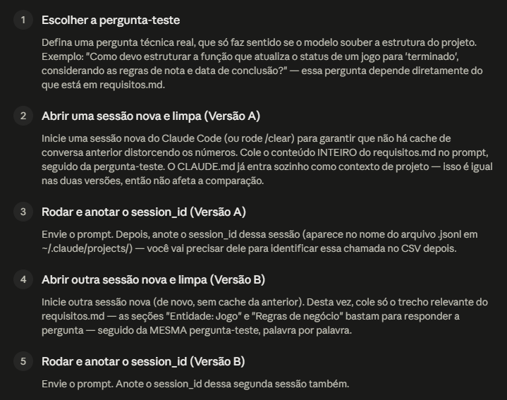
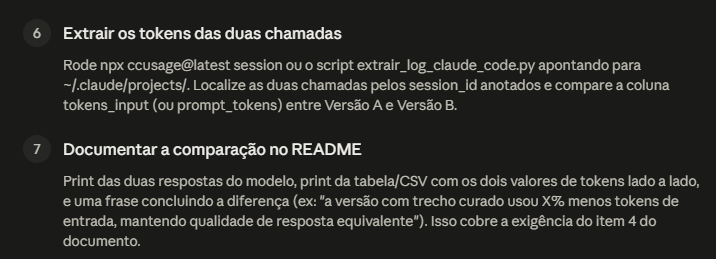

### Curadoria

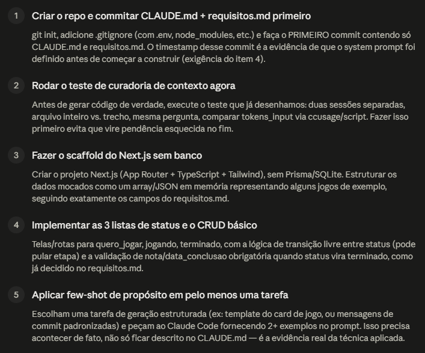
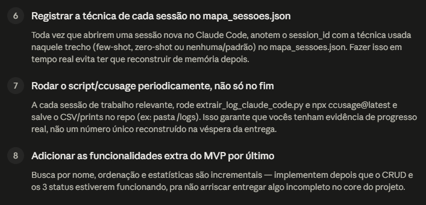

### Few x Zero

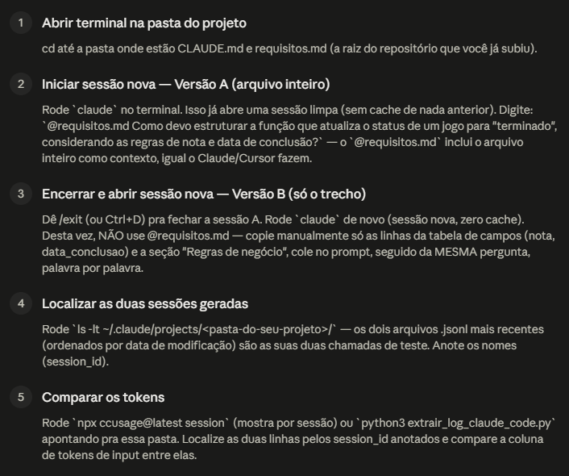
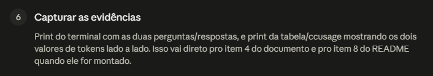

### Decisões system prompt e Técnica prompt

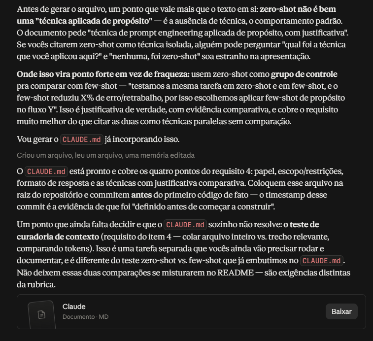
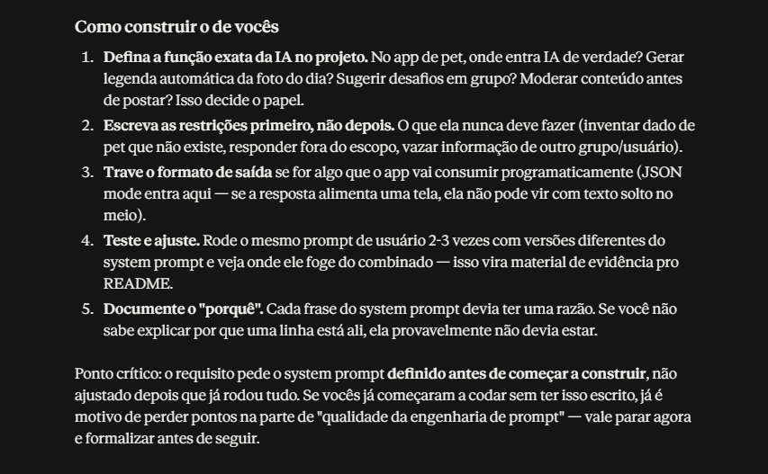

## Evolução do Projeto

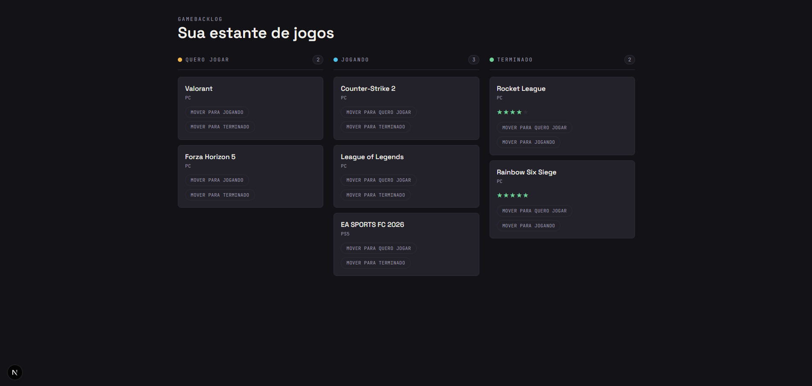
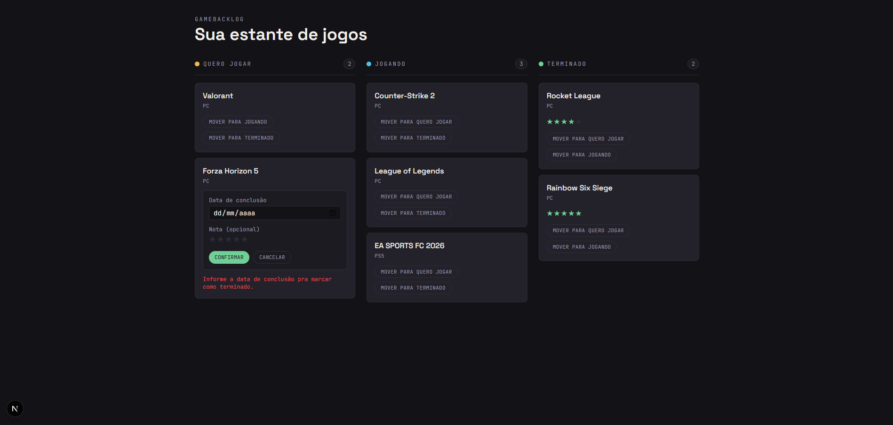
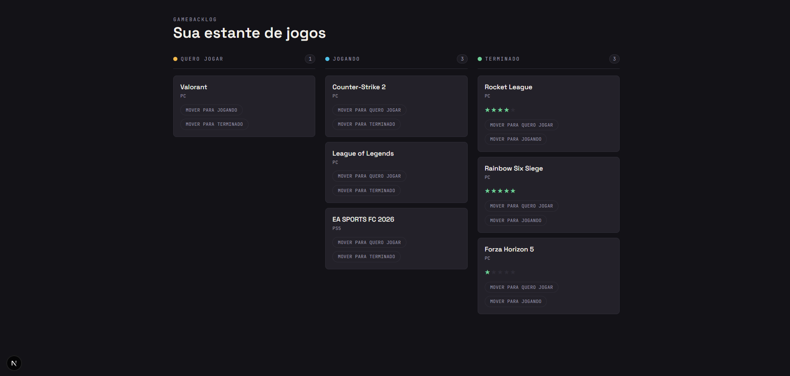
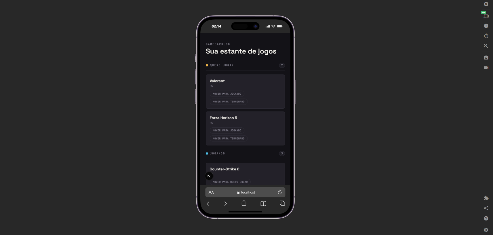
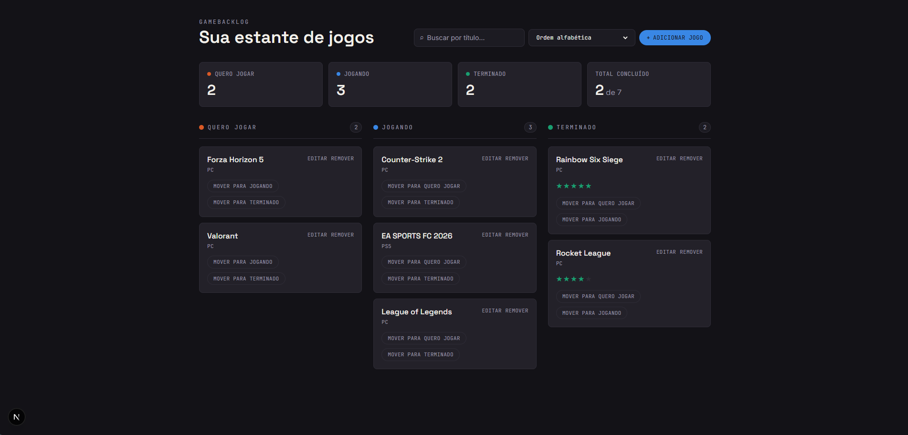

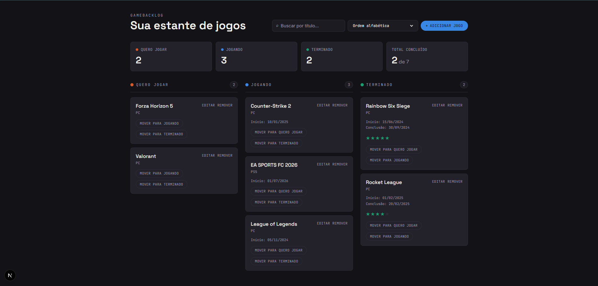
